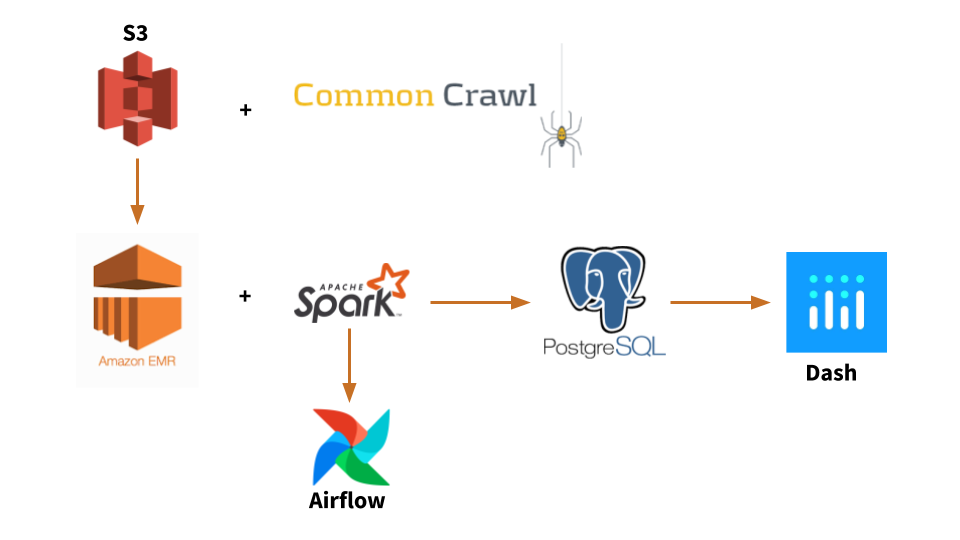
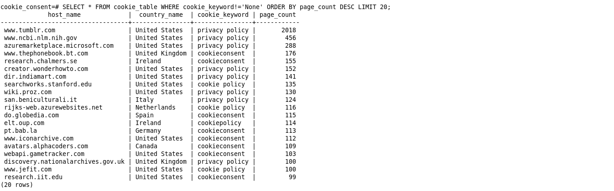

# Cookie Consent
** Who complies with Privacy Act **

## Motivation
* The General Data Protection Regulation (GDPR) was adopted by European countires in 2016 and became enforceable on May 25, 2018. 
* According to this law, companies must infrom the customers what data of theirs has been collected, delete it and stop selling it if the customer requests. 
* The fine for GDPR violators could by up to €20 million in some cases.
* Similar regulations have been adapted by other countries outside EU, including Chile, Japan, Brazil, South Korea, Argentina and Kenya. 
* The California Consumer Privacy Act (CCPA), adopted on 28 June 2018, has a lot of similarities with GDPR. It became effective on Jan 1st, 2020.
* The fines for CCPA violetors could add up — $7,500 per violation if intentional,input,500 for those lacking intent and $750 per affected user in civil damages.

## Approach
Cookie consent pipeline first catagorizes the web pages collected by Common Crawl project ( > 2.5 bilion webpages, > 47 TB data) based on their host IP addresses then check if the websites are comply with privacy act by searching certain keywords such as `cookie consent, cookie policy, privacy policy, privacy act and etc`. 

## Pipeline

  

## Data
Common Crawl dataset is used for this project ([Common Crawl database](https://commoncrawl.org/)). Common Crawl project crawls the webpages globaly every month. The data are stored on an AWS S3 database.

## Results

Following is an example of the output:

   

